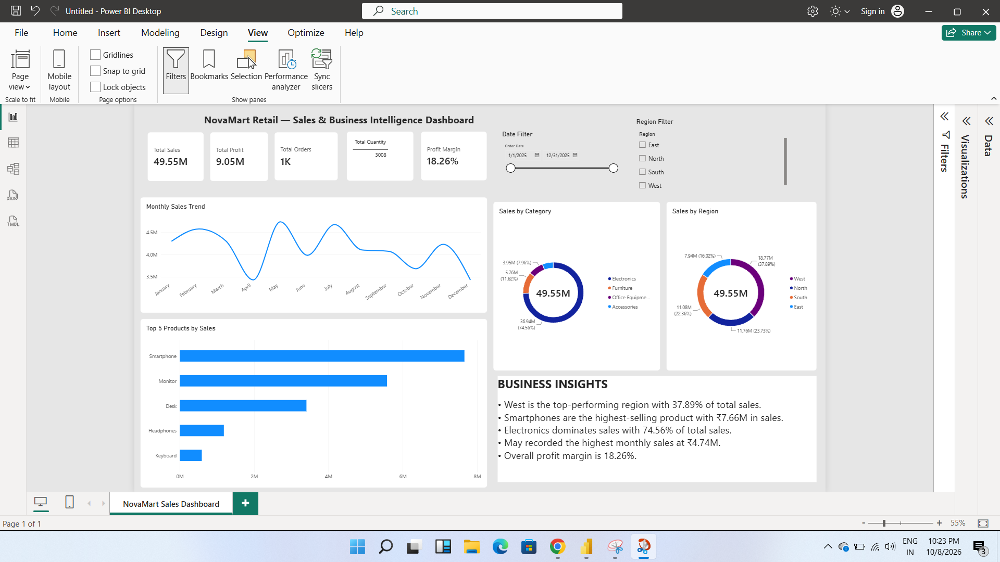

# NovaMart Retail — Sales & Business Intelligence Dashboard

## 📊 Project Overview

NovaMart Retail — Sales & Business Intelligence Dashboard is a Power BI analytics project designed to transform raw sales data into an interactive business intelligence dashboard.

The dashboard provides insights into sales performance, profitability, products, categories, regions, and monthly trends to support data-driven decision-making.

## 🛠️ Tools & Technologies

- Microsoft Power BI
- Power Query
- DAX
- Data Visualization
- Business Intelligence
- CSV Data

## 📌 Key Features

- Interactive Sales Dashboard
- KPI Cards
- Regional Sales Analysis
- Product Performance Analysis
- Category-wise Sales Analysis
- Monthly Sales Trend
- Profit & Profit Margin Analysis
- Interactive Date Filter
- Interactive Region Filter
- Business Insights

## 📈 Key Business Insights

- West is the top-performing region with 37.89% of total sales.
- Smartphones are the highest-selling product with ₹7.66M in sales.
- Electronics dominates sales with 74.56% of total sales.
- May recorded the highest monthly sales at ₹4.74M.
- Overall profit margin is 18.26%.

## 📊 Dashboard KPIs

- Total Sales: ₹49.55M
- Total Profit: ₹9.05M
- Total Orders: 1,000
- Total Quantity: 3,008
- Profit Margin: 18.26%

## 🎯 Project Objective

The objective of this project is to demonstrate how Power BI can transform raw sales data into meaningful visual insights and support business decision-making.

## 👩‍💻 Project Type

Portfolio / Demo Project

## ⚠️ Disclaimer

NovaMart Retail is a fictional company created for portfolio and demonstration purposes. The dataset is synthetic and does not represent real company data.
